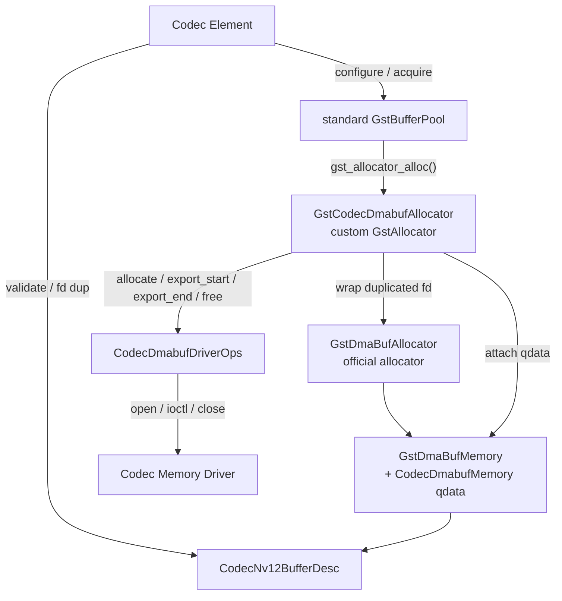
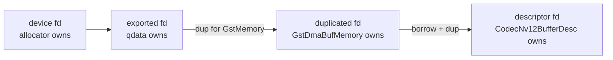
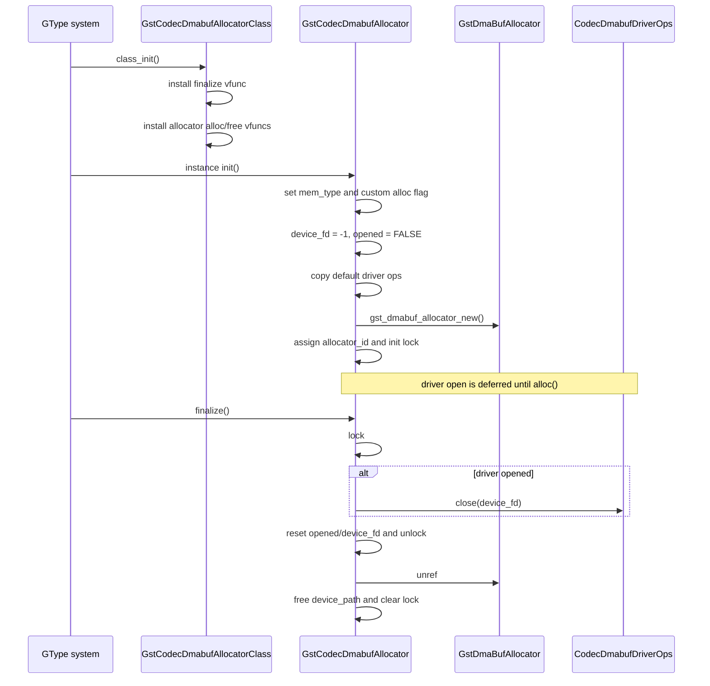
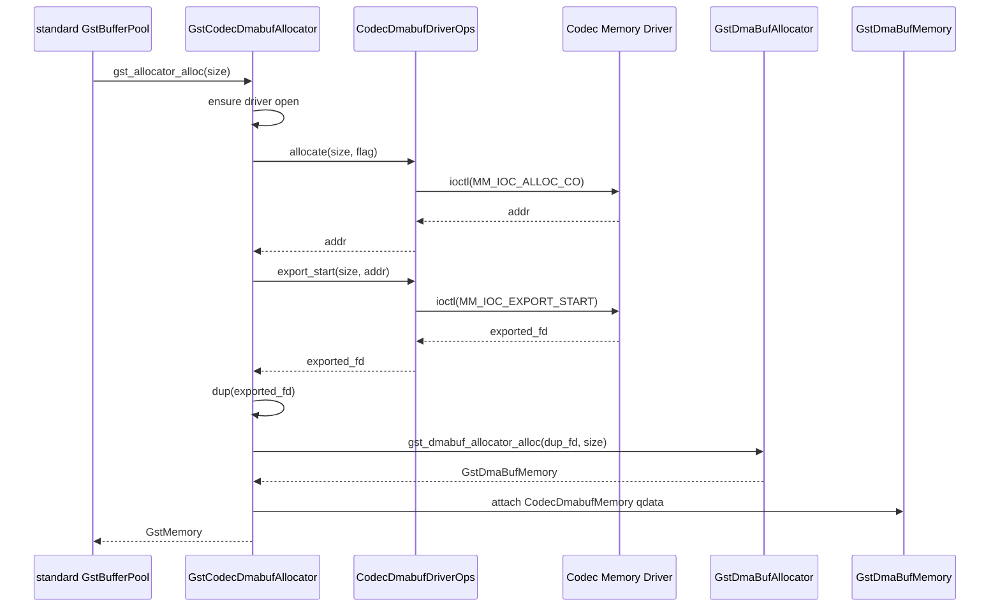
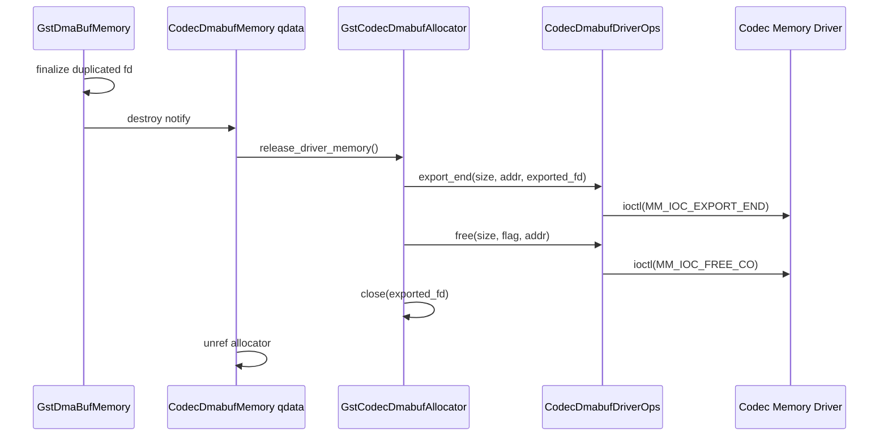
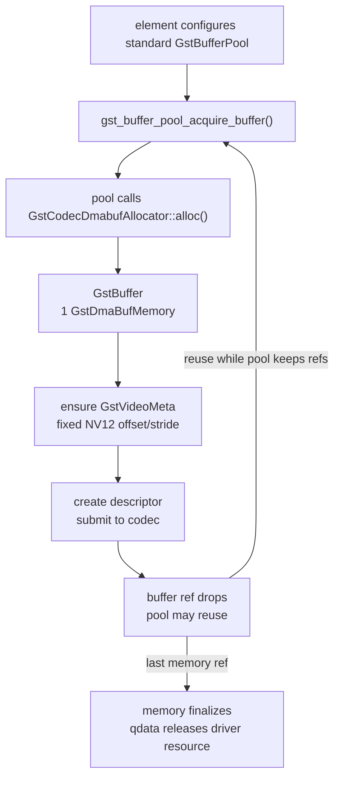

# DMABUF アロケータ設計

## 1. 目的

この文書は、hardware H.264 codec path で使用する DMABUF アロケータの設計を定義する。

設計の主目的は、driver 固有のメモリ寿命管理を custom allocator に集約し、buffer 再利用は GStreamer 標準機能に任せることである。

初期方針:

- custom `GstAllocator` を作る
- 実際の `GstMemory` には公式 `GstDmaBufMemory` を使う
- `GstDmaBufMemory` に qdata を付けて driver resource を紐づける
- buffer 再利用には標準 `GstBufferPool` を使う
- custom `GstBufferPool` は作らない
- custom `GstMemory` は作らない

`GstCodecDmabufAllocator` が driver allocation、`export_start`、`export_end`、`free` の所有者になる。

## 2. 対象範囲

Linux 専用とする。

前提:

- POSIX fd
- Linux `open()`
- Linux `close()`
- Linux `ioctl()`
- driver が codec 用メモリを確保できること
- driver が確保済みメモリを DMABUF fd として export できること
- encoder 入力と decoder 出力は NV12 raw frame であること

H.264 bitstream buffer はこのアロケータの対象外とする。`video/x-h264` の圧縮済み data は、別途必要になるまで通常の GStreamer buffer として扱う。

## 3. 主要方針

custom allocator が行う処理:

1. driver memory allocate
2. driver `export_start`
3. exported fd を公式 `GstDmaBufMemory` に wrap
4. `GstDmaBufMemory` へ allocator 由来情報と driver resource を qdata として付与
5. qdata destroy 時に driver `export_end`
6. qdata destroy 時に driver `free`

標準 `GstBufferPool` が行う処理:

1. buffer 再利用
2. min/max buffer 数管理
3. 設定された allocator 経由の memory allocation
4. pool active/flushing 管理

初期設計では `gstcodecdmabufpool` は作らない。pool 固有の driver 処理を持たせない。

## 4. モジュール構成

```text
src/
  gstcodecdmabufallocator.h
  gstcodecdmabufallocator.c
  gstcodecdmabufdriver.h
  gstcodecdmabufdriver.c
  gstcodecdmabufmemory.h
  gstcodecdmabufmemory.c
  gstcodecdmabufdesc.h
  gstcodecdmabufdesc.c
  gstcodecdmabufconfig.h
```

| ファイル | 責務 |
| --- | --- |
| `gstcodecdmabufallocator.*` | custom `GstAllocator`、driver open/close、allocate/export/free の所有。 |
| `gstcodecdmabufdriver.*` | Linux driver wrapper、fake driver ops 差し替え口。実 ioctl 定義が無い build では default ops は `ENOTSUP` を返す。 |
| `gstcodecdmabufmemory.*` | `GstDmaBufMemory` qdata、由来判定、fd dup helper。 |
| `gstcodecdmabufdesc.*` | NV12 descriptor 生成、buffer 検証。 |
| `gstcodecdmabufconfig.h` | 固定 format、layout、alignment、flow code 定数。 |

element は driver ioctl を直接呼ばない。driver resource の寿命は allocator と memory qdata に閉じる。

構造図:



ownership 境界:



## 5. 固定仕様

初期実装では format と最大サイズを固定する。

```c
#define CODEC_DMABUF_MAX_WIDTH        800
#define CODEC_DMABUF_MAX_HEIGHT       480
#define CODEC_DMABUF_FORMAT           GST_VIDEO_FORMAT_NV12
#define CODEC_DMABUF_N_PLANES         2

#define CODEC_DMABUF_STRIDE_ALIGN     32
#define CODEC_DMABUF_SIZE_ALIGN       32

#define CODEC_DMABUF_Y_OFFSET         0
#define CODEC_DMABUF_Y_STRIDE         800
#define CODEC_DMABUF_Y_HEIGHT         480

#define CODEC_DMABUF_UV_OFFSET        384000
#define CODEC_DMABUF_UV_STRIDE        800
#define CODEC_DMABUF_UV_HEIGHT        240

#define CODEC_DMABUF_ALLOCATION_SIZE  576000
```

実画像が 800x480 未満でも、driver allocation size は常に `CODEC_DMABUF_ALLOCATION_SIZE` とする。実際の visible width/height は caps、`GstVideoInfo`、`GstVideoMeta`、codec descriptor で扱う。

## 6. GstCodecDmabufAllocator

`GstCodecDmabufAllocator` は custom `GstAllocator` として実装する。

所有するもの:

- driver device path
- driver device fd
- driver ops
- allocator identity
- driver 状態を守る lock
- 内部で使用する公式 `GstDmaBufAllocator`

概念上の構造:

```c
typedef struct _GstCodecDmabufAllocator {
  GstAllocator parent;

  gchar *device_path;
  int device_fd;
  CodecDmabufDriverOps ops;

  GstAllocator *dmabuf_allocator;
  guint64 allocator_id;

  GMutex lock;
  gboolean opened;
} GstCodecDmabufAllocator;
```

`alloc` vfunc は driver で memory を確保し、公式 `GstDmaBufMemory` を返す。

### 6.1 class_init / init / finalize Flow

`GstCodecDmabufAllocator` は `G_DEFINE_TYPE()` で定義する GObject 型であり、class 初期化、instance 初期化、破棄処理の責務を分ける。

`class_init` では型全体の vfunc を登録する。ここでは instance 固有の fd や driver 状態は触らない。

```text
gst_codec_dmabuf_allocator_class_init:
  object_class = G_OBJECT_CLASS(klass)
  allocator_class = GST_ALLOCATOR_CLASS(klass)

  object_class->finalize = gst_codec_dmabuf_allocator_finalize
  allocator_class->alloc = codec_dmabuf_allocator_alloc
  allocator_class->free = codec_dmabuf_allocator_free
```

`init` では allocator instance ごとの初期状態を作る。driver device はここでは open しない。実際の open は最初の allocation 時に遅延実行する。

```text
gst_codec_dmabuf_allocator_init:
  allocator->mem_type = "CodecDmabuf"
  set GST_ALLOCATOR_FLAG_CUSTOM_ALLOC

  device_fd = -1
  ops = default driver ops
  dmabuf_allocator = gst_dmabuf_allocator_new()
  allocator_id = next unique id
  init lock
```

`finalize` では allocator instance が所有する resource だけを解放する。各 memory の driver allocation は `GstDmaBufMemory` qdata destroy path が解放するため、`finalize` では個別 buffer の `export_end/free` は行わない。

```text
gst_codec_dmabuf_allocator_finalize:
  lock
  if opened:
    close(device_fd)
  opened = FALSE
  device_fd = -1
  unlock

  unref internal GstDmaBufAllocator
  free device_path
  clear lock
  chain up to parent finalize
```

lifecycle sequence:



## 7. CodecDmabufMemory

driver resource の寿命情報は `GstDmaBufMemory` の `GstMiniObject` qdata に付与する。

```c
typedef struct {
  GstCodecDmabufAllocator *allocator;

  int device_fd;
  int exported_fd;
  gpointer addr;
  gsize size;

  gboolean export_active;
  guint64 allocator_id;

  guint width;
  guint height;
  GstVideoFormat format;

  guint n_planes;
  gsize offsets[GST_VIDEO_MAX_PLANES];
  gint strides[GST_VIDEO_MAX_PLANES];
} CodecDmabufMemory;
```

qdata destroy notify が driver cleanup を実行する。

```text
CodecDmabufMemory destroy:
  if export_active:
    export_end(device_fd, addr, exported_fd)
  if addr != NULL:
    free(device_fd, addr, size)
  close exported_fd if still owned
  unref allocator
```

この qdata が「この memory が本 allocator 由来か」を判定する根拠になる。

## 8. Allocation Flow

```text
GstCodecDmabufAllocator::alloc(size, params):
  validate size <= CODEC_DMABUF_ALLOCATION_SIZE
  ensure driver is open

  allocate:
    MmAllocIoctl.size = CODEC_DMABUF_ALLOCATION_SIZE
    MmAllocIoctl.flag = MM_CARVEOUT
    driver allocate -> addr

  export:
    MmExportIoctl.size = CODEC_DMABUF_ALLOCATION_SIZE
    MmExportIoctl.addr = addr
    driver export_start -> exported_fd

  wrap:
    dmabuf_memory_fd = dup(exported_fd)
    memory = gst_dmabuf_allocator_alloc(dmabuf_allocator, dmabuf_memory_fd, size)
    attach CodecDmabufMemory qdata to memory

  return memory
```

`gst_dmabuf_allocator_alloc()` へ渡す fd は必ず `dup()` した fd にする。渡した fd は公式 `GstDmaBufMemory` の所有になる。

途中で失敗した場合は、作成済み resource を逆順で巻き戻す。

```text
close duplicated fd if created
export_end
free
```

allocation sequence:



## 9. Free Flow

公式 `GstDmaBufMemory` は、`gst_dmabuf_allocator_alloc()` に渡された duplicated fd を所有する。

custom qdata は、driver allocation と driver から得た exported fd を所有する。

```text
GstDmaBufMemory finalize:
  close duplicated fd owned by GstDmaBufMemory
  run qdata destroy notify
    export_end original exported fd
    free driver allocation
```

重要な点は、custom allocator の `free` vfunc に driver cleanup を依存させないことである。返す memory は公式 `GstDmaBufMemory` なので、driver cleanup は memory qdata destroy path から必ず到達できる必要がある。

free sequence:



## 10. 標準 GstBufferPool の使用

element は標準 `GstBufferPool` を作成し、custom allocator を設定する。

```text
pool = gst_buffer_pool_new()
config = gst_buffer_pool_get_config(pool)
gst_buffer_pool_config_set_params(config, caps, CODEC_DMABUF_ALLOCATION_SIZE, min, max)
gst_buffer_pool_config_set_allocator(config, codec_dmabuf_allocator, NULL)
gst_buffer_pool_config_add_option(config, GST_BUFFER_POOL_OPTION_VIDEO_META)
gst_buffer_pool_set_config(pool, config)
gst_buffer_pool_set_active(pool, TRUE)
```

標準 pool は、設定された `GstCodecDmabufAllocator` に memory allocation を依頼するだけでよい。pool は driver の `export_start`、`export_end`、`free` を知らない。

標準 pool 経由の処理境界:



## 11. Buffer Metadata

codec path では NV12 layout metadata が必要になる。

pool から取得した buffer には以下を保証する。

- 1 frame は 1 個の DMABUF memory で表す
- `GstVideoMeta` を付与する
- `GstVideoMeta` には固定 offset/stride を設定する
- visible width/height は negotiated caps と一致させる

標準 pool が期待する `GstVideoMeta` を付与しない場合は、element 側の allocation helper が acquire 直後に付与する。

## 12. Memory Kind 判定

buffer は以下の kind に分類する。

| kind | 条件 | 扱い |
| --- | --- | --- |
| `CODEC_DMABUF` | 全 memory が DMABUF で、期待する allocator 由来の `CodecDmabufMemory` qdata を持つ。 | accept |
| `OTHER_DMABUF` | DMABUF だが qdata がない、または別 allocator 由来。 | reject |
| `SYSTEM` | DMABUF ではない memory。 | hardware zero-copy path では reject |
| `NONE` | 空、混在、memory layout 不正、判定不能。 | reject |

encoder 入力で accept する条件:

- memory kind が `CODEC_DMABUF`
- allocator identity が一致する
- NV12 layout が固定 layout と一致する
- visible width/height が negotiated input caps と一致する

driver import は初期スコープ外なので、外部 DMABUF は reject する。

## 13. Codec Descriptor

hardware codec へ渡す descriptor は `GstDmaBufMemory` から生成する。

```c
typedef struct {
  int dmabuf_fd;

  guint width;
  guint height;

  gsize y_offset;
  gint y_stride;

  gsize uv_offset;
  gint uv_stride;

  gsize size;
} CodecNv12BufferDesc;
```

descriptor 生成ルール:

- `gst_dmabuf_memory_get_fd()` で borrowed fd を取得する
- codec に渡して保持する fd は必ず `dup()` する
- duplicated fd 利用中は対応する `GstBuffer` ref を保持する
- codec 完了時に descriptor clear で duplicated fd を close する

## 14. Encoder Flow

```text
set_format:
  validate NV12 caps
  create GstCodecDmabufAllocator
  create standard GstBufferPool configured with allocator
  propose allocation upstream

handle_frame:
  classify input buffer
  reject system memory and external DMABUF
  create CodecNv12BufferDesc from GstDmaBufMemory
  hold GstBuffer ref
  submit to hardware encoder

complete:
  close descriptor fd
  unref held GstBuffer
  finish encoded H.264 output buffer
```

encoder は push 型 `GstVideoEncoder` のままとする。scheduling pull mode は実装しない。

## 15. Decoder Flow

```text
set_format / negotiate:
  validate H.264 input caps
  negotiate NV12 output caps
  create GstCodecDmabufAllocator
  create standard GstBufferPool configured with allocator

decode:
  acquire output buffer from standard pool
  ensure GstVideoMeta is present
  create CodecNv12BufferDesc from GstDmaBufMemory
  hold GstBuffer ref
  submit to hardware decoder

complete:
  close descriptor fd
  unref held GstBuffer
  push decoded output buffer
```

downstream がこの custom DMABUF path を扱えない場合、hardware zero-copy path は negotiation failure とする。初期設計では system memory への copy fallback は行わない。

## 16. Error Policy

| case | result |
| --- | --- |
| unsupported caps | `GST_FLOW_NOT_NEGOTIATED` |
| hardware zero-copy input が system memory | `GST_FLOW_NOT_NEGOTIATED` |
| qdata がない外部 DMABUF | `GST_FLOW_NOT_NEGOTIATED` |
| driver open failure | state change failure |
| driver allocate failure | `GST_FLOW_ERROR` |
| driver export failure | `GST_FLOW_ERROR` |
| standard pool acquire failure | pool の flow return を伝播 |

rollback 中の cleanup error は log に出す。ただし元の streaming error を隠さない。

## 17. Thread Safety

allocator は streaming path と state-change path の両方から参照される。

同期対象:

- device fd の open/closed 状態
- driver が thread-safe でない場合の driver ops 呼び出し
- allocator identity
- shutdown 状態

qdata destroy path は最後の memory ref が落ちた thread で実行されうる。pool deactivation、element stop、allocation rollback の後でも安全に動作する必要がある。

## 18. Test Policy

単体テストでは fake `CodecDmabufDriverOps` を使う。

必要なテスト:

- `alloc` が driver `allocate` の後に `export_start` を呼ぶこと
- 返る memory が公式 DMABUF memory であること
- memory に `CodecDmabufMemory` qdata が付くこと
- `gst_dmabuf_allocator_alloc()` へ duplicated fd が渡ること
- qdata destroy が `export_end`、`free` の順で呼ぶこと
- allocation rollback が逆順 cleanup を行うこと
- 標準 pool が custom allocator 経由で buffer を確保できること
- memory kind が `CODEC_DMABUF`、`OTHER_DMABUF`、`SYSTEM`、`NONE` を返すこと
- encoder が外部 DMABUF と system memory を reject すること
- descriptor fd が duplicated fd であり、descriptor clear で close されること
- `GstVideoMeta` に固定 NV12 offset/stride が付与されること

## 19. Implementation Order

1. `gstcodecdmabufconfig.h` に固定 layout 定数を追加する。
2. `gstcodecdmabufdriver.*` に real/fake driver ops を追加する。
3. `GstCodecDmabufAllocator` を `GstAllocator` subclass として実装する。
4. `CodecDmabufMemory` qdata helper を実装する。
5. allocator `alloc` と rollback を実装する。
6. qdata destroy cleanup を実装する。
7. memory kind 判定 helper を実装する。
8. NV12 descriptor create/clear を実装する。
9. 標準 `GstBufferPool` に custom allocator を設定する helper を実装する。
10. encoder allocation proposal と入力検証へ接続する。
11. decoder output allocation へ接続する。
12. fake driver を使った単体テストを追加する。
