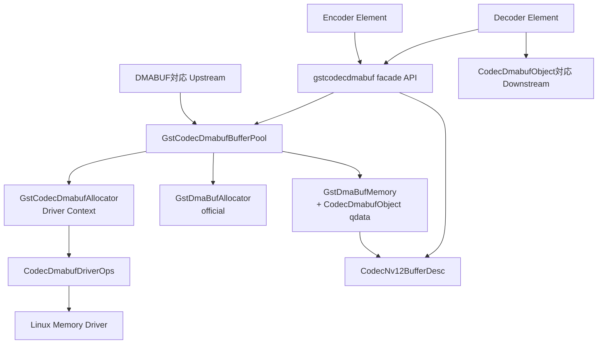
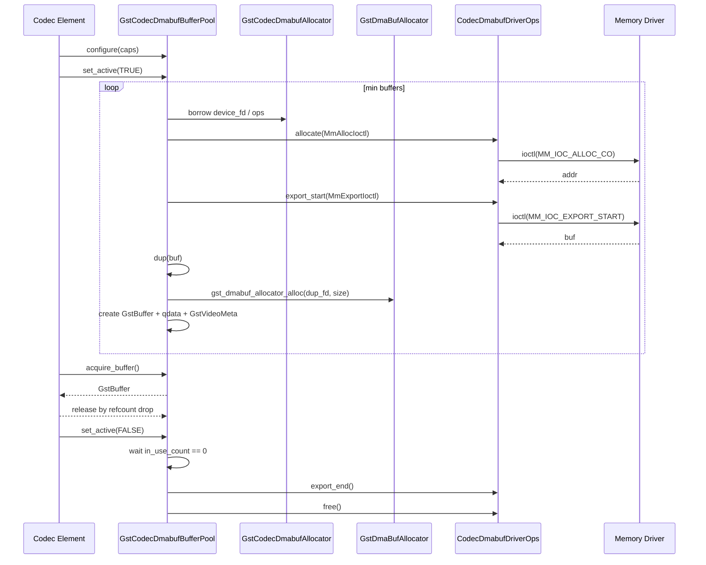

# GStreamer DMABUF Allocator / Buffer Pool 設計書

## 1. 目的

本設計書は、codec elementのencoder入力およびdecoder出力に、DMABUF backedな
`GstBuffer`をゼロコピーで提供するための共通モジュール設計を定義する。

一度確保したメモリは`GstBufferPool`で再利用する。非DMABUF input/outputはcopy fallbackせず、
negotiation failureまたはbuffer処理failureとして扱う。

## 2. 設計方針

本設計はLinux専用とする。POSIX fd、Linux `open()`、Linux `close()`、Linux `ioctl()`、
DMABUFを前提にする。

GStreamer標準で扱える処理は公式APIを使用する。

| 目的 | 使用API |
|---|---|
| DMABUF memory作成 | `GstDmaBufAllocator` / `gst_dmabuf_allocator_alloc()` |
| DMABUF判定 | `gst_is_dmabuf_memory()` |
| DMABUF fd取得 | `gst_dmabuf_memory_get_fd()` |
| pool設定取得 | `gst_buffer_pool_get_config()` |
| pool caps/size/min/max設定 | `gst_buffer_pool_config_set_params()` |
| pool allocator設定 | `gst_buffer_pool_config_set_allocator()` |
| pool option設定 | `gst_buffer_pool_config_add_option()` |
| pool設定反映 | `gst_buffer_pool_set_config()` |
| pool active切替 | `gst_buffer_pool_set_active()` |
| buffer取得 | `gst_buffer_pool_acquire_buffer()` |
| acquire制御 | `GstBufferPoolAcquireParams` |
| buffer返却 | `gst_buffer_pool_release_buffer()`またはrefcount drop |
| video metadata付与 | `gst_buffer_add_video_meta_full()` |

本モジュールの独自処理は、driver ioctl、driver lifetime管理、pool再利用、
`CodecDmabufObject`によるpool由来判定、`CodecNv12BufferDesc`生成に限定する。

capsではDMABUFまたは独自memory typeを強制しない。capsは通常の`video/x-raw`として扱い、
buffer受信時に公開APIでDMABUFかどうか、および本モジュールのpool由来かどうかを判定する。

## 3. 固定仕様

初期実装では以下をビルド時定数として定義する。element propertyによる変更は行わない。

```c
#define CODEC_DMABUF_MAX_WIDTH        800
#define CODEC_DMABUF_MAX_HEIGHT       480
#define CODEC_DMABUF_FORMAT           GST_VIDEO_FORMAT_NV12
#define CODEC_DMABUF_N_PLANES         2

#define CODEC_DMABUF_STRIDE_ALIGN     32
#define CODEC_DMABUF_SIZE_ALIGN       32

#define CODEC_DMABUF_MIN_BUFFERS      2
#define CODEC_DMABUF_MAX_BUFFERS      4

#define CODEC_DMABUF_Y_PLANE          0
#define CODEC_DMABUF_UV_PLANE         1

#define CODEC_DMABUF_Y_OFFSET         0
#define CODEC_DMABUF_Y_STRIDE         800
#define CODEC_DMABUF_Y_HEIGHT         480

#define CODEC_DMABUF_UV_OFFSET        384000
#define CODEC_DMABUF_UV_STRIDE        800
#define CODEC_DMABUF_UV_HEIGHT        240

#define CODEC_DMABUF_ALLOCATION_SIZE  576000

#define CODEC_DMABUF_UNSUPPORTED_CAPS_FLOW      GST_FLOW_NOT_NEGOTIATED
#define CODEC_DMABUF_UNSUPPORTED_MEMORY_FLOW    GST_FLOW_NOT_NEGOTIATED
#define CODEC_DMABUF_EXTERNAL_DMABUF_FLOW       GST_FLOW_NOT_NEGOTIATED
#define CODEC_DMABUF_UNSUPPORTED_UPSTREAM_FLOW  GST_FLOW_NOT_NEGOTIATED
#define CODEC_DMABUF_DRIVER_ERROR_FLOW          GST_FLOW_ERROR
```

NV12 layoutは以下で固定する。

```text
y_stride  = align_up(800, 32) = 800
uv_stride = y_stride          = 800
y_offset  = 0
uv_offset = align_up(800 * 480, 32) = 384000
size      = align_up(384000 + 800 * 240, 32) = 576000
```

実画像サイズが800x480未満でも、driver allocation sizeは常に`CODEC_DMABUF_ALLOCATION_SIZE`
とする。実画像width/heightはcaps、`GstVideoInfo`、`GstVideoMeta`、codec descriptorで扱う。

## 4. モジュール構成

elementからは原則として`gstcodecdmabuf.h`のみをincludeする。driver ioctl、pool内部構造、
fd所有権処理は共通モジュール内に閉じる。

```text
gstcodec/
  dmabuf/
    gstcodecdmabuf.h
    gstcodecdmabuf.c
    gstcodecdmabufallocator.h
    gstcodecdmabufallocator.c
    gstcodecdmabufpool.h
    gstcodecdmabufpool.c
    gstcodecdmabufmemory.h
    gstcodecdmabufmemory.c
    gstcodecdmabufdriver.h
    gstcodecdmabufdriver.c
    gstcodecdmabufdesc.h
    gstcodecdmabufdesc.c
    gstcodecdmabufconfig.h

  elements/
    gstcodecencoder.c
    gstcodecdecoder.c
```

| ファイル | 責務 |
|---|---|
| `gstcodecdmabuf.h/.c` | element向けfacade API |
| `gstcodecdmabufallocator.*` | driver context、device fd所有、driver ops提供 |
| `gstcodecdmabufpool.*` | custom `GstBufferPool`、buffer再利用、driver allocate/export/free |
| `gstcodecdmabufmemory.*` | `GstDmaBufMemory`生成補助、`CodecDmabufObject` qdata、fd dup |
| `gstcodecdmabufdriver.*` | Linux `open/close/ioctl` wrapper、fake差し替え口 |
| `gstcodecdmabufdesc.*` | `CodecNv12BufferDesc`生成、buffer検証 |
| `gstcodecdmabufconfig.h` | 定数、layout、flow code |

全体構成:



## 5. 公開API

```c
typedef struct _GstCodecDmabufAllocator GstCodecDmabufAllocator;

typedef enum {
  GST_CODEC_DMABUF_MEMORY_KIND_NONE = 0,
  GST_CODEC_DMABUF_MEMORY_KIND_CODEC_DMABUF,
  GST_CODEC_DMABUF_MEMORY_KIND_OTHER_DMABUF,
  GST_CODEC_DMABUF_MEMORY_KIND_SYSTEM
} GstCodecDmabufMemoryKind;

GstCodecDmabufAllocator *gst_codec_dmabuf_allocator_new (
    const gchar *device_path);

GstBufferPool *gst_codec_dmabuf_pool_new (
    GstCodecDmabufAllocator *allocator,
    guint64 pool_id);

gboolean gst_codec_dmabuf_pool_configure (
    GstBufferPool *pool,
    GstCaps *caps);

gboolean gst_codec_dmabuf_propose_allocation (
    GstQuery *query,
    GstCodecDmabufAllocator *allocator,
    GstBufferPool *pool);

gboolean gst_codec_dmabuf_buffer_is_dmabuf (
    GstBuffer *buffer);

GstCodecDmabufMemoryKind gst_codec_dmabuf_buffer_get_memory_kind (
    GstBuffer *buffer);

const gchar *gst_codec_dmabuf_memory_kind_to_string (
    GstCodecDmabufMemoryKind kind);

gboolean gst_codec_dmabuf_buffer_is_codec_dmabuf (
    GstBuffer *buffer);

gboolean gst_codec_dmabuf_buffer_is_supported_input (
    GstBuffer *buffer,
    GstCodecDmabufAllocator *allocator,
    guint64 expected_pool_id);

gboolean gst_codec_dmabuf_buffer_to_nv12_desc (
    GstBuffer *buffer,
    guint width,
    guint height,
    CodecNv12BufferDesc *out_desc);

void gst_codec_dmabuf_nv12_desc_clear (
    CodecNv12BufferDesc *desc);
```

API利用ルール:

- elementはdriver ioctlを直接呼ばない
- elementはpool内部構造を直接参照しない
- elementは`CodecDmabufObject`内部のfdやaddrを直接変更しない
- descriptor利用中は対応する`GstBuffer` refを保持する
- duplicated fdは利用完了時に`gst_codec_dmabuf_nv12_desc_clear()`でcloseする

## 6. データ構造

### 6.1 Driver Context

`GstCodecDmabufAllocator`はGStreamer memory allocatorではなく、driver contextである。
GStreamer memory allocatorには公式`GstDmaBufAllocator`を使う。

```c
typedef struct _GstCodecDmabufAllocator {
  GObject parent;

  gchar *device_path;
  int device_fd;
  CodecDmabufDriverOps ops;

  GMutex lock;
  gboolean opened;
} GstCodecDmabufAllocator;
```

### 6.2 CodecDmabufObject

`CodecDmabufObject`はdriverが管理する元fd、確保済みaddr、layout、pool識別子を保持する。
`GstMemory`へprivate dataを埋め込まず、`GstBuffer`の`GstMiniObject qdata`へ紐づける。

```c
typedef struct {
  gint ref_count;
  GstCodecDmabufAllocator *allocator;

  int device_fd;
  int dmabuf_fd;
  gsize size;
  gpointer mapped_addr;

  gboolean export_active;

  guint width;
  guint height;
  GstVideoFormat format;
  guint64 pool_id;

  guint n_planes;
  gsize offsets[GST_VIDEO_MAX_PLANES];
  gint strides[GST_VIDEO_MAX_PLANES];
} CodecDmabufObject;
```

`CodecDmabufObject`はrefcount付きobjectとする。

- pool tableが1 refを保持する
- `GstBuffer` qdataが1 refを保持する
- qdata keyは本モジュール専用`GQuark`とする
- qdata destroy notifyは`CodecDmabufObject`のrefを落とすだけで、driver ioctlを呼ばない
- driver resourceの`export_end`と`free`はpool stopだけが実行する

これにより、`GstBuffer`破棄時のqdata destroy notifyとpool stop時のdriver解放処理を分離する。

### 6.3 Buffer Pool

```c
typedef struct {
  GstBuffer *buffer;
  CodecDmabufObject *object;
  gboolean in_use;
} CodecDmabufPoolBuffer;

typedef struct {
  GstBufferPool parent;

  GstCodecDmabufAllocator *allocator;
  GstAllocator *dmabuf_allocator;

  GstCaps *caps;
  GstVideoInfo info;

  guint min_buffers;
  guint max_buffers;
  guint allocated_buffers;

  GQueue available;
  GHashTable *all_buffers;

  gboolean active;
  gboolean flushing;
  guint in_use_count;

  GMutex lock;
  GCond cond;
} GstCodecDmabufBufferPool;
```

### 6.4 Codec Descriptor

codec hardwareへ渡すdescriptorはNV12専用とする。

```c
typedef struct {
  int dmabuf_fd;

  guint width;
  guint height;

  gsize y_offset;
  gint y_stride;

  gsize uv_offset;
  gint uv_stride;

  gsize size;
} CodecNv12BufferDesc;
```

`dmabuf_fd`は`gst_dmabuf_memory_get_fd()`で得たborrowed fdを`dup()`したfdである。
codec完了時にcallerがcloseする。fd利用中は対応する`GstBuffer` refを保持する。

## 7. Driver IF

driver accessは`CodecDmabufDriverOps`で抽象化する。通常実装はLinux APIを呼び、
単体テストではfake opsへ差し替える。

```c
typedef struct _MmAllocIoctl {
  gsize size;
  guint flag;
  gpointer addr;
} MmAllocIoctl;

typedef struct _MmExportIoctl {
  gsize size;
  gpointer addr;
  int buf;
} MmExportIoctl;

typedef struct {
  int (*open) (const char *device_path);
  int (*close) (int device_fd);
  int (*allocate) (int device_fd, MmAllocIoctl *arg);
  int (*free) (int device_fd, MmAllocIoctl *arg);
  int (*export_start) (int device_fd, MmExportIoctl *arg);
  int (*export_end) (int device_fd, MmExportIoctl *arg);
} CodecDmabufDriverOps;
```

| IF | Linux実装 | 引数 | 呼び出し元 |
|---|---|---|---|
| `open` | `open(device_path, O_RDWR | O_CLOEXEC)` | device path | allocator handle |
| `close` | `close(device_fd)` | device fd | allocator handle |
| `allocate` | `ioctl(MM_IOC_ALLOC_CO)` | `MmAllocIoctl{size, flag, addr}` | buffer pool |
| `free` | `ioctl(MM_IOC_FREE_CO)` | `MmAllocIoctl{size, flag, addr}` | buffer pool |
| `export_start` | `ioctl(MM_IOC_EXPORT_START)` | `MmExportIoctl{size, addr, buf}` | buffer pool |
| `export_end` | `ioctl(MM_IOC_EXPORT_END)` | `MmExportIoctl{size, addr, buf}` | buffer pool |

`allocate/free`の`flag`は`MM_CARVEOUT`固定とする。

`export_start/export_end`は`addr`でexport対象の確保済みメモリを識別する。`buf`はdriverが返す、
またはdriverへ返却するDMABUF fdである。

driverにimport機能はないため、外部DMABUFは本モジュールのpool由来bufferとして扱わない。

## 8. 所有権

| 対象 | 所有者 | 解放タイミング |
|---|---|---|
| device fd | `GstCodecDmabufAllocator` | allocator finalizeまたはelement stop |
| driver allocation addr | `CodecDmabufObject` / pool | pool stopで`free` |
| driver元DMABUF fd | `CodecDmabufObject` / pool | pool stopで`export_end` |
| `GstDmaBufMemory`へ渡すfd | `GstDmaBufMemory` | memory finalize時にclose |
| descriptor fd | descriptor caller | codec完了時にclose |
| `GstBuffer` | `GstBufferPool` / downstream refs | refcount dropでpoolへ返却 |

fdルール:

- `export_start`で得た元fdはpool/object所有であり、callerへ直接渡さない
- `gst_dmabuf_allocator_alloc()`へ渡すfdは、元fdを`dup()`したfdにする
- `gst_dmabuf_allocator_alloc()`へ渡したfdは`GstDmaBufMemory`所有になる
- `GST_FD_MEMORY_FLAG_DONT_CLOSE`は初期実装では使用しない
- `gst_dmabuf_memory_get_fd()`で得たfdはborrowed fdとして扱う
- borrowed fdをcodecや外部へ渡して保持する場合は必ず`dup()`する
- duplicated fd利用中は、対応する`GstBuffer` refを保持する

## 9. Buffer Pool処理

### 9.1 Configure

pool configureでは以下を行う。

1. capsを`GstVideoInfo`へ変換する
2. formatがNV12であることを確認する
3. width/heightが800x480以下であることを確認する
4. `gst_buffer_pool_config_set_params()`でcaps、固定allocation size、min/maxを設定する
5. `gst_buffer_pool_config_set_allocator()`で公式`GstDmaBufAllocator`を設定する
6. `GST_BUFFER_POOL_OPTION_VIDEO_META`を追加する

capsにDMABUF caps featureは要求しない。

### 9.2 Start

pool startでは`CODEC_DMABUF_MIN_BUFFERS`分を事前確保する。

```text
for each initial buffer:
  allocate:
    MmAllocIoctl.size = CODEC_DMABUF_ALLOCATION_SIZE
    MmAllocIoctl.flag = MM_CARVEOUT
    ioctl(MM_IOC_ALLOC_CO) -> addr

  export_start:
    MmExportIoctl.size = CODEC_DMABUF_ALLOCATION_SIZE
    MmExportIoctl.addr = addr
    ioctl(MM_IOC_EXPORT_START) -> buf

  object:
    object = codec_dmabuf_object_new()
    object->dmabuf_fd = buf
    object->mapped_addr = addr
    object->pool_id = pool_id
    object->strides/offsets = fixed NV12 layout
    pool table keeps 1 object ref

  GstMemory:
    gst_memory_fd = dup(object->dmabuf_fd)
    memory = gst_dmabuf_allocator_alloc(dmabuf_allocator, gst_memory_fd, object->size)

  GstBuffer:
    buffer = gst_buffer_new()
    attach GstDmaBufMemory
    attach GstVideoMeta by gst_buffer_add_video_meta_full()
    attach CodecDmabufObject as GstBuffer qdata with 1 additional object ref
    push to available queue
```

`gst_dmabuf_allocator_alloc()`が失敗した場合、duplicated fdをcloseし、`export_end`、`free`の順で
巻き戻す。

### 9.3 Acquire / Release

acquire:

- available queueからbufferを取り出す
- なければ最大数まで追加確保する
- 最大数に達していれば、`GstBufferPoolAcquireParams`に従って待機または即時失敗する
- flushing中は`GST_FLOW_FLUSHING`を返す
- 取得したbufferをin-useにし、`in_use_count`を増やす

acquire paramsの扱い:

| 条件 | 動作 |
|---|---|
| paramsがNULL | bufferがreleaseされるまで`GCond`で待つ |
| `GST_BUFFER_POOL_ACQUIRE_FLAG_DONTWAIT`あり | 待機せず`GST_FLOW_EOS`を返す |
| flushing中 | `GST_FLOW_FLUSHING`を返す |

`DONTWAIT`時のflowは初期実装では`GST_FLOW_EOS`に統一する。

release:

- bufferをavailable queueへ戻す
- `in_use_count`を減らす
- acquire待ちまたはstop待ちthreadへ`GCond`でsignalする
- release時に`export_end`または`free`は呼ばない

### 9.4 Stop

pool stopでは新規acquireを禁止し、in-use bufferが全て戻るまで無期限に待つ。
timeoutは設けない。待機はbusy loopではなく`GCond`で行う。

```text
stop:
  set flushing = TRUE
  wait until in_use_count == 0

  for each pool buffer:
    export_end(MmExportIoctl{size, addr, buf})
    free(MmAllocIoctl{size, flag, addr})
    clear object export_active / mapped_addr / dmabuf_fd state
    gst_buffer_unref(buffer)
    release pool table object ref
```

poolはdevice fdをcloseしない。device fdはallocator handleが所有する。
qdata destroy notifyはobject refを落とすだけであり、`export_end`、`free`、`close`は呼ばない。

### 9.5 Poolフロー図



## 10. Encoder / Decoderフロー

### 10.1 Decoder出力

decoderは出力bufferのallocationを所有する。

```text
start:
  allocator = gst_codec_dmabuf_allocator_new(device_path)
  pool = gst_codec_dmabuf_pool_new(allocator, decoder_pool_id)

negotiate:
  gst_codec_dmabuf_pool_configure(pool, caps)

decode:
  gst_buffer_pool_acquire_buffer(pool, &buffer, NULL)
  gst_codec_dmabuf_buffer_to_nv12_desc(buffer, width, height, &desc)
  codec_ref = gst_buffer_ref(buffer)
  submit(desc)

complete:
  gst_codec_dmabuf_nv12_desc_clear(&desc)
  gst_buffer_unref(codec_ref)
  push buffer
```

downstreamが`GstDmaBufMemory`と`CodecDmabufObject`付きbufferを扱える場合のみゼロコピーになる。
非対応downstreamは初期スコープ外とし、negotiation failureとする。

初期実装ではcaps featureでdownstream対応を表現しない。decoderが接続可能とみなすdownstreamは、
本モジュールの公開APIで`CodecDmabufObject` qdataを確認できるcustom対応要素のみとする。
element固有のpad query、factory名、または内部接続ポリシーでcustom対応を確認できない場合は、
streaming開始前にnegotiation failureとする。

### 10.2 Encoder入力

encoderはsink allocation queryで本モジュールのpool使用をupstreamへ提案する。
upstreamはDMABUF対応要素に限定する。

```text
propose allocation:
  allocator = gst_codec_dmabuf_allocator_new(device_path)
  pool = gst_codec_dmabuf_pool_new(allocator, encoder_pool_id)
  gst_codec_dmabuf_pool_configure(pool, caps)
  gst_codec_dmabuf_propose_allocation(query, allocator, pool)

chain:
  if !gst_codec_dmabuf_buffer_is_supported_input(buffer, allocator, encoder_pool_id):
    return GST_FLOW_NOT_NEGOTIATED

  gst_codec_dmabuf_buffer_to_nv12_desc(buffer, width, height, &desc)
  codec_ref = gst_buffer_ref(buffer)
  submit(desc)

complete:
  gst_codec_dmabuf_nv12_desc_clear(&desc)
  gst_buffer_unref(codec_ref)
```

encoderがacceptする条件:

```text
memory kind == GST_CODEC_DMABUF_MEMORY_KIND_CODEC_DMABUF
gst_is_dmabuf_memory(memory) == TRUE
CodecDmabufObject qdataあり
allocator handle一致
pool_id一致
```

外部DMABUFとsystem memoryはrejectする。

## 11. Memory Kind判定

`gst_codec_dmabuf_buffer_get_memory_kind()`はbuffer内の全`GstMemory`を確認する。
複数memoryが混在する場合は`GST_CODEC_DMABUF_MEMORY_KIND_NONE`としてrejectする。

| kind | 条件 | 扱い |
|---|---|---|
| `CODEC_DMABUF` | `gst_is_dmabuf_memory()`がTRUE、かつ`CodecDmabufObject` qdataあり | allocator handle/pool_id一致ならaccept |
| `OTHER_DMABUF` | `gst_is_dmabuf_memory()`がTRUE、qdataなし | reject |
| `SYSTEM` | `gst_is_dmabuf_memory()`がFALSE | reject |
| `NONE` | buffer NULL、memory数0、混在、判定不能 | reject |

`gst_codec_dmabuf_buffer_is_dmabuf()`は公式`gst_is_dmabuf_memory()`のみで判定する。
本モジュール由来かどうかは`gst_codec_dmabuf_buffer_get_memory_kind()`または
`gst_codec_dmabuf_buffer_is_codec_dmabuf()`で判定する。

## 12. Video Metadata

bufferには公式APIの`gst_buffer_add_video_meta_full()`で`GstVideoMeta`を付与する。

| 項目 | 値 |
|---|---|
| format | NV12 |
| width | 実画像width |
| height | 実画像height |
| n_planes | 2 |
| Y offset | `CODEC_DMABUF_Y_OFFSET` |
| Y stride | `CODEC_DMABUF_Y_STRIDE` |
| UV offset | `CODEC_DMABUF_UV_OFFSET` |
| UV stride | `CODEC_DMABUF_UV_STRIDE` |

1 frameは1つのDMABUF fdで表現し、Y planeとUV planeはoffset/strideで表す。
`GstVideoMeta`のoffset/stride配列には上記固定値を設定する。width/heightは実画像サイズを設定し、
memory sizeは常に`CODEC_DMABUF_ALLOCATION_SIZE`とする。

## 13. CPU Map / Cache Sync

CPU mappingは初期スコープ外とする。本モジュール内部では`GST_MAP_READ` / `GST_MAP_WRITE`に
依存した処理を行わない。

公式`GstDmaBufMemory`を使用するため、外部からmap要求された場合の成否はGStreamer allocatorと
driverの挙動に従う。本モジュールはmap成功を前提にしない。

cache sync APIも使用しない。将来CPU accessが必要になった場合は、driver IFに`map`、`unmap`、
`sync_for_cpu`、`sync_for_device`を追加することを検討する。

## 14. エラーハンドリング

初期デフォルトのfailure mapping:

| ケース | デフォルト |
|---|---|
| unsupported caps | `GST_FLOW_NOT_NEGOTIATED` |
| unsupported pixel format | `GST_FLOW_NOT_NEGOTIATED` |
| encoder入力がsystem memory | `GST_FLOW_NOT_NEGOTIATED` |
| encoder入力が外部DMABUF | `GST_FLOW_NOT_NEGOTIATED` |
| upstreamがDMABUF非対応 | `GST_FLOW_NOT_NEGOTIATED` |
| downstreamがDMABUF出力非対応 | `GST_FLOW_NOT_NEGOTIATED` |
| driver open失敗 | `GST_STATE_CHANGE_FAILURE` |
| driver allocate/export/free失敗 | `GST_FLOW_ERROR` |
| buffer pool acquire失敗 | `GST_FLOW_ERROR` |
| pool stopped中のacquire | `GST_FLOW_FLUSHING` |
| `DONTWAIT`指定かつbuffer不足 | `GST_FLOW_EOS` |
| EOS後のacquire | `GST_FLOW_EOS` |

streaming開始前に検出できる不一致はnegotiation failureにする。
streaming中のdriver errorは`GST_FLOW_ERROR`にする。

## 15. Thread Safety

allocator handleとpoolは、streaming threadとstate-change threadの両方からアクセスされる。

同期対象:

- device fd状態
- pool active/flushing状態
- available queue
- all buffer table
- `in_use_count`
- stop待機条件

pool stopはin-use bufferを強制解放しない。in-use bufferが戻るまで`GCond`で無期限に待つ。

## 16. Debug Logging

debug logは、driver呼び出し、pool状態、fd lifetime、descriptor生成、codec submit/completeを
後から追跡できる粒度で出力する。

```c
GST_DEBUG_CATEGORY_STATIC (codec_dmabuf_debug);
#define GST_CAT_DEFAULT codec_dmabuf_debug
```

| 対象 | 内容 | レベル |
|---|---|---|
| driver open/close | device path、device fd、result、errno | DEBUG/ERROR |
| allocate/free | size、flag、addr、result、errno | DEBUG/ERROR |
| export_start/end | size、addr、buf、result、errno | DEBUG/ERROR |
| pool configure/start/stop | pool_id、caps、size、min/max、in_use_count | DEBUG |
| pool acquire/release | pool_id、buffer pointer、fd、available_count、in_use_count | LOG |
| pool stop wait | pool_id、in_use_count | DEBUG |
| qdata attach/get | buffer pointer、object pointer、pool_id | LOG |
| fd dup | source fd、duplicated fd、用途 | LOG |
| descriptor create | fd、width、height、stride、offset、size | LOG |
| codec submit/complete | fd、buffer pointer、pool_id | DEBUG |
| reject input | reason、memory kind、pool_id if available | WARNING |

payloadや画像データはlogへ出力しない。

## 17. テスト方針

単体テストではfake `CodecDmabufDriverOps`を使用し、driver実機に依存しない検証を行う。

主なテスト項目:

- pool start時に`min_buffers`分の`allocate`と`export_start`が呼ばれること
- `gst_dmabuf_allocator_alloc()`へduplicated fdが渡されること
- `GstBuffer` qdataから`CodecDmabufObject`を取得できること
- pool tableとqdataがそれぞれ`CodecDmabufObject` refを保持し、qdata destroy notifyではdriver ioctlを呼ばないこと
- `GstDmaBufMemory`であってもqdataがない場合は`OTHER_DMABUF`になること
- buffer release時に`export_end`と`free`が呼ばれないこと
- release後に同じbufferが再利用されること
- pool stop時に`export_end -> free`の順で呼ばれること
- in-use bufferが残っている場合、pool stopが`GCond`で待機すること
- in-use buffer release後にpool stopが再開すること
- `GST_BUFFER_POOL_ACQUIRE_FLAG_DONTWAIT`時にbuffer不足なら待機せず`GST_FLOW_EOS`を返すこと
- driver `export_start`失敗時に確保済みmemoryが`free`されること
- `gst_codec_dmabuf_buffer_is_dmabuf()`が`gst_is_dmabuf_memory()`を使うこと
- memory kindが`CODEC_DMABUF` / `OTHER_DMABUF` / `SYSTEM` / `NONE`を返すこと
- allocator handleまたはpool_id不一致のbufferをencoder入力でrejectすること
- external DMABUFとsystem memoryをencoder入力でrejectすること
- descriptor fdが`gst_dmabuf_memory_get_fd()`後の`dup()`で作られること
- `GstVideoMeta`が`gst_buffer_add_video_meta_full()`で固定offset/stride付きで付与されること
- custom対応を確認できないdownstreamはnegotiation failureになること
- duplicated fd利用中に対応する`GstBuffer` refが保持されること
- codec complete時にduplicated fd closeとcodec用buffer ref unrefが行われること
- 本モジュール内部で`GST_MAP_READ` / `GST_MAP_WRITE`に依存しないこと
- debug logが主要なdriver/pool/fd/descriptor/codec状態を追跡できること

無期限待機仕様は、別threadでpool stopを開始し、待機状態に入ったことを確認してから
buffer release signalを発火して検証する。

## 18. 推奨実装順序

1. `gstcodecdmabufconfig.h`に固定定数とlayoutを定義する。
2. `CodecDmabufDriverOps`とLinux wrapperを実装する。
3. fake driver opsを実装し、driver call orderの単体テストを作る。
4. `GstCodecDmabufAllocator` driver contextを実装する。
5. `CodecDmabufObject`、qdata helper、fd dup helperを実装する。
6. 公式`GstDmaBufAllocator`による`GstDmaBufMemory`生成補助を実装する。
7. custom `GstBufferPool`のconfigure/start/acquire/release/stopを実装する。
8. `GstVideoMeta`付与を実装する。
9. `CodecNv12BufferDesc`生成とclearを実装する。
10. memory kind判定APIを実装する。
11. encoder allocation query提案を実装する。
12. decoder出力とencoder入力へfacade APIを接続する。
13. エラー処理、debug logging、単体テストを追加する。

## 19. 確定事項

| 項目 | 方針 |
|---|---|
| target platform | Linux専用 |
| memory type | 公式`GstDmaBufMemory` |
| 独自`GstMemory` | 実装しない |
| caps memory feature | 使用しない |
| driver allocation | frameごとに1 fd |
| driver import | 非対応 |
| external DMABUF | reject |
| system memory | reject |
| CPU mapping | 本モジュールでは使用しない |
| cache sync API | 使用しない |
| downstream | `GstDmaBufMemory` + `CodecDmabufObject` qdata対応要素のみ |
| upstream for encoder | DMABUF対応要素のみ |
| pool stop timeout | なし。in-use bufferが戻るまで無期限待機 |
